# Stroke Prediction

## Description
Healthcare data of individuals from Kaggle was used to train a machine learning algorithm. This algorithm's aim was to optimise the prediction on whether an individual was going to have a stroke or not, based on the variables in the dataset.

## Table of Contents

- [Installation](#Installation)
- [Data Cleaning](#Data-Cleaning)
- [Visualisations](#Visualisations)
- [Preprocessing For Baseline Models](#Preprocessing-For-Baseline-Models)
- [Models and Optimisation](#Models-and-Optimisation)
- [Credits](#Credits)
- [Contact](#Contact)

## Installation
Python, Pandas, Matplotlib, NumPy, Seaborn, postgresSQL, pgAdmin, Sci-kit learn, Imbalanced-learn

## Data Cleaning
Data cleaning was achieved by rounding the ages in decimals to the nearest full age. Gender 'Other' was dropped, which affected only one row. Also, the column smoking_status was dropped for the second round as it containted a large number of 'Unknown' values which means that the information is unavailable for this patient.

After saving both files as stroke_cleaned_v1.csv and stroke_cleaned_v2.csv, a few aggregate analysis were performed in SQL to give a brief overview on the dataset. 

## Visualisations

So we have these visualisations to explore the distribution of the data and highlight any key insights, trends or patterns which may influence the machine learning model and optimisation techniques

### Feature Importance

The feature importance predictive model highlights the following influential factors:

'avg_glucose_level,' 'age,' and 'bmi' contribute 27.40%, 25.91%, and 22.05%, respectively.
Health-related features ('hypertension' and 'heart_disease') play a smaller role.
Employment ('work_type') and residence types ('residence_type') contribute.
Gender, marital status, and certain BMI categories have a lesser impact.

As a result of this, the main features to be explored further will be the blood sugar, age and BMI.

### Correlation and Age Significance

Key correlations exist among age, average glucose level, BMI, and stroke risk. Age correlates positively with average glucose level (0.24) and BMI (0.32), indicating higher levels with age. Overall it appears that age is a strong influential factor. So let’s explore this further.

Individuals with a stroke tend to be older, with a mean age of 67.73 years, compared to those without a stroke, who have a mean age of 41.99 years. The age distribution for those with a stroke has a higher mean, median, and interquartile range, indicating that strokes are more prevalent among older individuals. The age range for both groups spans from 1 to 82 years. These statistics provide insights into the age distribution within each group and can be valuable for understanding the demographic characteristics associated with strokes.

The older you get the more likely you are to have a stroke. But the data is highly skewed with only about 1 in 20 people actually experiencing a stroke (which you will see later on, influenced our model choice and optimization). 

Age emerges as a crucial predictor, with an imbalanced dataset emphasizing its significance.

### BMI and Blood Sugar Insights

Let’s take a further look at the relationship between age and the other two notable features, blood glucose and BMI, and how this data is spread.

Individuals with a stroke, on average, have a slightly higher mean BMI compared to those without a stroke. The distribution of BMI is narrower among individuals with a stroke, as indicated by the lower standard deviation, suggesting less variability in BMI within this group.

For BMI we can see the data is far more clustered, with the exception of extreme BMI's. There appears to be a negative correlation between age and BMI (the older you get the lower your BMI). The incidence of stroke in those of an overweight and obese BMI seems to increase the older you get. 

For the Blood sugar you can see the data is far more variable, but there is a positive relationship between age and blood sugar. The pink dots show those patients who had a stroke and you can see the data is quite spread out towards the extremes of blood sugar. So this may suggest that blood sugar control becomes more important the older you get in terms of managing stroke risk.

As briefly mentioned, there are anomalous results. These visualisations are key to highlight issues such as this as most models will require normally distributed data in order to ‘learn’ effectively and make accurate predictions.

## Preprocessing For Baseline Models

stroke_cleaned_v1.csv is cleaned, by converting the age to its nearest integer, and removed Gender "other" which was one row of data. We kept maximum data and have not dropped any column in this dataset. We tested Five models of supervised machine learning by perserving maximum data.

### Splitting the Data 
Data set is split into Target Variable y that has the stroke column. 
X contains the features independent variables, (after deleting the stroke column) that will be used to predict the target variable.

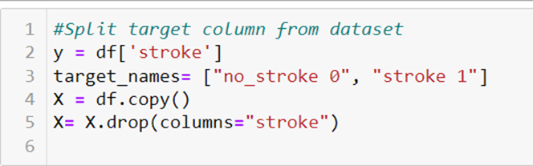

Splitting the data into Training and Testing Sets

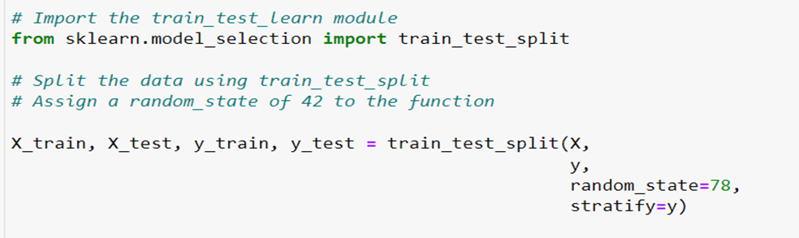

Stardarised the data by using the StandardScaler from sKlearn

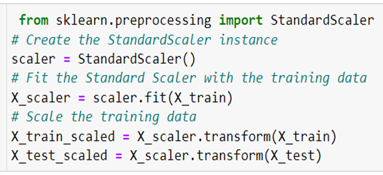

Handling Imbalanced Data by using Oversampling with SMOTE And RandomOverSampler from imblearn.over_sampling

### Supervised Machine Learning Models
We used 5 Machine Learning models 

Logistic Regression Model
 Model_LR = LogisticRegression(solver='lbfgs’, max_iter=200,random_state=78)

K_nearest neighbors 
             Model_knn = KNeighborsClassifier(n_neighbors=5)

Descision Tree
	model_DT = tree.DecisionTreeClassifier()

Random Forest
	rf_model = RandomForestClassifier(n_estimators=500, random_state=78)

Support Vector Machine (SVM)
	model_svm = SVC(kernel='linear')

    All above Models has been run on Original data , Oversampled Data with RandomoverSampler and Smote

After Closely observing the Confusion Matrix and classification reports of all the 5 models, We further optimise the Random Forest Model, Support vector MAchine and descion Tree .
The SVM with Oversampled Data offered the best Recall and accuracy for further optimisation
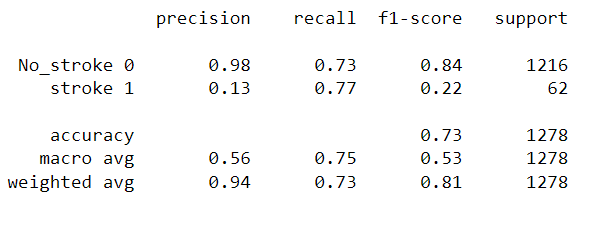

Confusion Matrix of SVM with oversampled data is showing relatively a low number of False Negatives, though the False positives with the number of 330 is not good so we are further optimising this model to see if its accuracy that is currently 73%, can be improved.

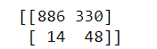

## Models and Optimisation

We noticed that by running Features Importance on the original dataset whilst we were testing out different models, smoking status was not really useful. This column was therefore dropped.There was also 1 row where the gender was reported as "other", so we dropped this row. This was the first part of our optimisation, done using SQL.

During optimisation, we used various techniques to optimise for precision and recall. The techniques alongside their classification report, with explanation, is as follows:

### 1. Oversampling data and using RandomForestClassifier

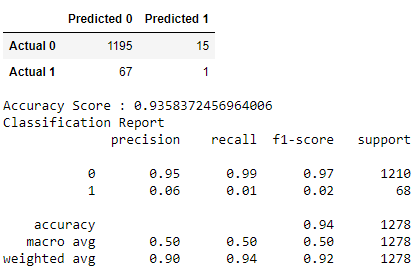

    We originally went with this model to optimise because it had the highest accuracy score, despite the recall and precision being very poor for those who had been predicted to have a stroke and actually had a stroke. Majority of our optimisation was focused here, thinking we could somehow improve the model using various different algorithms.

    Thus, the first thing we tried was to oversample and scale the data. This was done using RandomOverSampler and Standard Scaler.

    Result: The false negative is 67, this is a high risk group. They have been incorrectly identified as 'no-stroke' when in reality the result is 'stroke'. This has resulted in poor precision and recall for 'stroke' prediction, so this needs to be improved. We can improve this but first we need to re-look at what features in the data is most important when it comes to training the algorithm again.

    The features most important were 'age', 'avg_glucose_level' and 'bmi'.

### 2. Oversampling data, dropping columns found less important, and using RandomForestClassifier

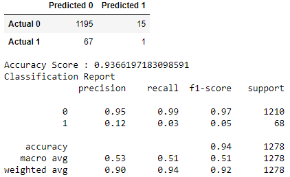

    This has improved the precision and recall, but only slightly, not good enough for our dataset. 

### 3. Random Forest Classifier optimised using GridSearchCV

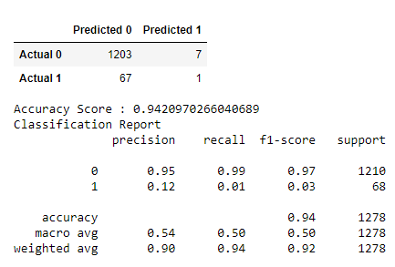

    GridSearchCV Was used as an automated way to generate the best parameters to improve the recall. Max_features = 11 and max_depth = 14 seemed to be the best.
    Thus, the RandomForestClassifier model was re-run on the data (not oversampled) with the new params to see if it improved the recall.
    Unfortunately, precision improved with this dataset but the recall did not. n-estimators = 100 was also changed, which didn't do anything useful, so we returned this param to n-estimators = 100.
    Thus, using GridSearchCV was unsuccessful.

### 4. Outliers removed from original dataset, oversampled, using RandomForestClassifier

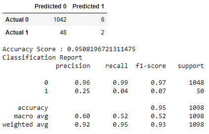

    This has improved the precision and recall even more, but again only slightly, not good enough for our dataset.

### 5. Balancing no-stroke to match stroke, using RandomForestClassifier

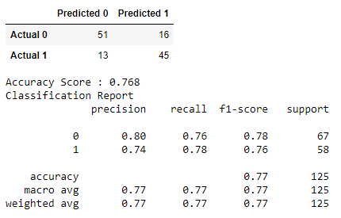

    This optimisation was the most difficult to justify. The original dataset had to be changed to balance the 'no-stroke' to match the 'stroke' numbers. This made them even. However, this meant we lost a lot of data, thousands of rows. Furthermore, any further optimisation we applied did not add value as the balanced dataset did not match or reflect the structure of the original dataset. Although the confusion matrix was fantastic and much more what we were looking for, we had to abandon this approach as in real life, it did not reflect.

    For example, in real life, the number of people that do not have strokes far outweighs the number of people that have strokes. In our balanced dataset however, the algorithm is trained to think 50:50 stroke vs no stroke. This is obviously a big problem if a clinician was to apply this algorithm to real-life people.

### 6. Outliers removed, oversampled, using Support Vector Model

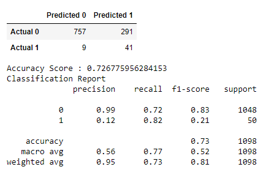

    Another model that showed good potential was the Support Vector model. This was our chosen model to use, and had we more time and could potentially try other optimisations on them, we would've focused our attention here.

    This model, although giving us an accuracy of 73%, gave us a recall of 82%. Unfortunately though, the precision for prediction stroke was still only 12%. The false negatives, i.e. the 291 people it incorrectly classified as "stroke" but really they had "no-stroke", is just poor prediction when a clinician has to use it on real-life people. Unnecessary health scares, can make people worried. It also can make a clinician look incompetent at supporting people to manage their risk of strokes. We definitely do not want our model to have such a poor precision for this reason.

### 7. Outliers removed, oversampled, using Decision Tree Model

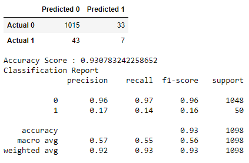

Finally, this was also tried, however it's obvious again that although the accuracy was high, precision and recall still aren't high-enough for us to reliably say this model works. This would be the second model we would work on, in order to further optimise it if we had more time.

## Credits
Maliha, Jo, Sophie, Farheen

## Contact
If there are any questions of concerns, I can be reached at:
##### [github: @jojoalva, @spribojac, @foomatia, @malihaspk]
